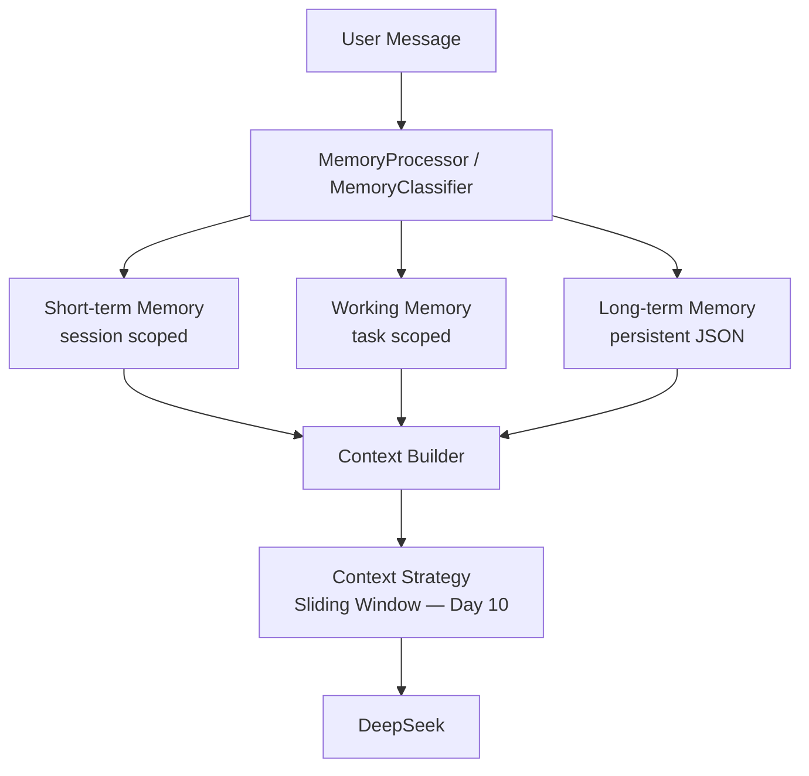
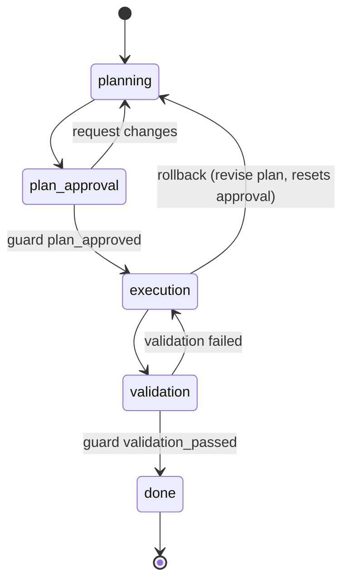

# LLM Agent Lab

An **educational** web application that demonstrates a complete modern web
stack: a user opens a browser page, types a question, clicks **Send**, and
receives an answer generated by a cloud LLM API (**DeepSeek** or
**OpenRouter**).

> The project intentionally showcases: paid cloud LLM APIs, REST API
> integration, backend development (FastAPI), persistent **Agent** context
> (SQLite), frontend development (vanilla HTML/CSS/JS), automated testing
> (pytest), Docker, Nginx and production deployment preparation.

---

## Architecture

The Agent layer has two teaching stages that share the **same** `Agent` class:

* **Day 6 — Первый агент:** one request in, one answer out, no memory
  (`POST /api/day6/agent/chat` → fresh transient Agent).
* **Day 7 — Сохранение контекста:** the same Agent plus history, SQLite
  persistence and restore after restart (`POST /api/chat`,
  `GET /api/chat/history` → `default` Agent via `AgentManager`).

The HTTP layer no longer manages context:

```
Frontend (HTML + CSS + vanilla JS)
   |
   |  POST /api/day6/agent/chat      POST /api/chat   GET /api/chat/history
   v
FastAPI (Uvicorn)
   |  Pydantic validation (schemas)
   v
AgentManager (registry / factory)
   |  create_transient(...)            get_or_create("default")
   v
Agent  (one per agent_id / per call)
   ├─ AgentConfig          (provider, model, system_prompt, temperature, max_tokens)
   ├─ messages / history   (Day 6: in-memory only; Day 7: restored on first use)
   ├─ ContextRepository → InMemory (Day 6) / SQLiteContextRepository → data/agents.db (Day 7)
   └─ LLMClient → DeepSeekService / OpenRouterService → cloud LLM API
```

The older DeepSeek-only flow still exists underneath:

```
Browser → FastAPI → DeepSeekService (OpenAI SDK -> https://api.deepseek.com)
```

Production topology:

```
Internet -> Nginx :80 -> Basic Auth -> rate limit -> FastAPI :8000 (inside Docker network only)
```

## Technologies

| Layer            | Technology                                   |
|------------------|----------------------------------------------|
| Language         | Python 3.12                                  |
| Web framework    | FastAPI + Uvicorn                            |
| Templating       | Jinja2                                       |
| Frontend         | HTML, CSS, vanilla JavaScript (no framework) |
| LLM client       | Official OpenAI Python SDK (DeepSeek-compatible) |
| Validation       | Pydantic                                     |
| Testing          | pytest, pytest-asyncio, httpx, pytest-cov    |
| Containers       | Docker, Docker Compose, Nginx                |

## Folder structure

```
.
├── app/
│   ├── __init__.py
│   ├── main.py            # FastAPI app factory + entry point
│   ├── config.py          # environment-based configuration
│   ├── api/
│   │   └── routes.py      # /, /health, chat, agents, compare, reasoning...
│   ├── agents/            # Day 6/7 — the Agent layer
│   │   ├── agent.py       # Agent: owns dialog, calls LLM, persists
│   │   ├── config.py      # AgentConfig (per-agent settings)
│   │   ├── llm.py         # LLMClient protocol + DeepSeek/OpenRouter adapters
│   │   ├── manager.py     # AgentManager registry/factory (+ transient agents)
│   │   ├── models.py      # Message (role/content/created_at)
│   │   └── repository.py  # ContextRepository + InMemory + SQLite implementations
│   ├── services/
│   │   ├── deepseek.py    # DeepSeekService (OpenAI SDK wrapper)
│   │   ├── openrouter_service.py  # OpenRouterService (Day 5)
│   │   ├── token_estimate.py      # local token estimation (Day 8)
│   │   ├── day8.py / day9.py      # token accounting / compression services
│   │   ├── structured_json.py    # robust model-JSON parsing (Day 11)
│   │   ├── day10/         # Day 10 — context strategies
│   │   │   ├── strategies.py   # SlidingWindow / StickyFacts / Branching
│   │   │   ├── facts.py        # structured facts extraction (strict JSON)
│   │   │   ├── models.py       # Conversation / Branch / BranchMessage
│   │   │   ├── scenario.py     # shared TS scenario + demo metric
│   │   │   └── service.py      # orchestration + token accounting
│   │   └── day11/         # Day 11 — memory layers
│   │       ├── classifier.py   # MemoryClassifier (structured decision)
│   │       ├── store.py        # layers + long-term JSON persistence
│   │       ├── scenario.py     # demo scenario + demo metric
│   │       └── service.py      # orchestration + context builder
│   │   └── day12/         # Day 12 — user profile / personalization
│   │       ├── profile.py      # profile -> instructions + presets + store
│   │       └── service.py      # applies the profile on top of Day 11 memory
│   ├── schemas/
│   │   ├── chat.py        # Pydantic request/response models
│   │   ├── agent.py       # Agent request/response models (Day 6 + Day 7)
│   │   ├── day10.py       # Day 10 strategies / facts / branch schemas
│   │   ├── day11.py       # Day 11 memory layers schemas
│   │   └── day12.py       # Day 12 user profile / personalization schemas
│   ├── templates/
│   │   └── index.html     # single-page frontend
│   └── static/
│       ├── css/style.css
│       └── js/            # app.js, day3..day12.js
├── data/                  # SQLite Agent DB + Day 11 long-term JSON + Day 12 profile (git-ignored)
├── tests/                 # pytest suite (LLM calls mocked)
├── nginx/nginx.conf       # production Nginx config
├── Dockerfile
├── docker-compose.yml
├── DEPLOY.md              # step-by-step VPS deployment guide
├── DAY6_DEMO.md           # Day 6 video-recording cheat sheet
├── DAY7_DEMO.md           # Day 7 video-recording cheat sheet
├── DAY11_DEMO.md          # Day 11 video-recording cheat sheet
├── DAY12_DEMO.md          # Day 12 video-recording cheat sheet
├── .env.example           # copy to .env and add your key
└── requirements*.txt
```

## DeepSeek API integration

The app uses the official OpenAI Python SDK pointed at DeepSeek's
OpenAI-compatible endpoint:

```python
AsyncOpenAI(
    api_key=settings.deepseek_api_key,
    base_url="https://api.deepseek.com",
    timeout=settings.deepseek_timeout_seconds,
)
```

Model: `deepseek-v4-flash`. Every request includes a system prompt
("You are a helpful educational assistant…").

**Security rules implemented:**

- The API key is read **only** from the `DEEPSEEK_API_KEY` environment
  variable (or the git-ignored `.env` file). It is never hardcoded.
- The key is **never** exposed to frontend JavaScript — the browser only
  ever talks to our own `/api/chat` / `/api/compare` endpoints.
- No secrets are committed. `.env` is in `.gitignore`.

## Управление ответом модели (учебное задание)

Образовательное сравнение: один и тот же запрос отправляется в DeepSeek дважды —
«Без ограничений» и «С ограничениями» — и показывает, как API-управление ответом
меняет результат.

Запрос по умолчанию (редактируемый):

> Напиши список основных продуктов для приготовления борща на 4 порции.

### Зачем дважды

Чтобы изолировать влияние настроек, текст запроса в обоих вызовах **одинаков**.
Сравнение выполняется через один `POST /api/compare`, который делает ровно **два**
обращения к DeepSeek.

### Без ограничений (unrestricted)

Оригинальный запрос + обычное системное сообщение + стандартный лимит токенов
(`DEFAULT_MAX_TOKENS = 1024`). Без `response_format`, без `max_tokens` из формы,
без `stop`, без инструкций о структуре JSON.

### С ограничениями (controlled)

Тот же запрос + реальные API-управление ответом:

| Управление                | Механизм API                        | Что это |
|---------------------------|-------------------------------------|---------|
| Формат ответа             | `response_format={"type":"json_object"}` (фиксирован) | JSON Output — ответ обязан быть JSON-объектом |
| Структура ответа          | инструкция в `messages` (`json_structure`) | задаёт желаемые ключи (products/name/count/unit) |
| Максимальная длина        | `max_tokens` (по умолчанию 500)     | лимит генерируемых токенов |
| Завершение                | `stop=[...]` (необязательно, пусто по умолчанию) | стоп-последовательность |

### response_format vs структура JSON

`response_format` — **API-параметр уровня формата**: он говорит «верни объект JSON»,
но сам по себе не задаёт поля. Поля (`name`, `count`, `unit` …) описываются
**отдельно** через редактируемую «Требуемую структуру JSON-ответа», которая
передаётся как **инструкция в messages** (это не SDK-конфиг и не произвольные
аргументы). Редактируемая структура валидируется как непустой JSON-объект на
клиенте и на бэкенде (HTTP 422 до вызова провайдера).

### max_tokens

`max_tokens` — реальный API-лимит генерации (не обрезка в Python/JS). Токен ≠
буква и ≠ слово. Модель может закончить раньше; при исчерпании лимита
`finish_reason` станет `"length"`. Слишком малый лимит может дать незавершённый JSON.

### stop — необязательно

`stop` **пуст по умолчанию** и в этом случае **не передаётся** в API:

```python
client.chat.completions.create(..., response_format={"type":"json_object"}, max_tokens=500)
```

Если ввести, например, `STOP`, то уйдёт `stop=["STOP"]`. `stop` — «прекрати
генерацию при достижении указанной последовательности» (в отличие от
`max_tokens` — «не больше N токенов»). Для JSON стоп обычно не нужен: у JSON есть
естественное завершение. Плохо подобранный `stop` может оборвать генерацию
**внутри** JSON и дать некорректный/незавершённый ответ — это ограничение
показывается студенту. Поле существует потому, что задание требует
продемонстрировать API-управление завершением.

Ранее в демонстрации применялся искусственный маркер `END_OF_RESPONSE`, который
делал вывод ненадёжным (модель могла не выдать маркер, а стоп обрывал JSON).
Теперь маркер НЕ добавляется, и JSON-ответ имеет естественное окончание.

### finish_reason

Показывается реальный `choices[0].finish_reason`: `stop` (штатно/по стоп-условию)
или `length` (достигнут `max_tokens`). Если провайдерный запрос не удался,
показывается «недоступна — запрос завершился ошибкой». Значение не выдумывается.

### Частичный сбой

Если «Без ограничений» успешно, а «С ограничениями» нет, приложение показывает
ответ unrestricted, сообщение об ошибке controlled, а также **запрошенные**
параметры (`response_format`, `max_tokens`, `stop`, `json_structure`). Повторных
платных вызовов не делается.

### Стоимость

Одно сравнение = один `POST /api/compare` = ровно **два** обращения к DeepSeek.
Эндпоинт под Nginx Basic Auth и общим rate limit (5 запросов/мин на IP), так что
расход ограничен.

### Пример

```bash
curl -u student:password -X POST http://localhost/api/compare   -H "Content-Type: application/json"   -d '{
    "message": "Напиши список основных продуктов для приготовления борща на 4 порции.",
    "json_structure": {"products": [{"name": "Название продукта", "count": "Количество", "unit": "Единица измерения"}]},
    "max_tokens": 500,
    "stop_sequence": null
  }'
```

```json
{
  "unrestricted": {"answer": "...", "finish_reason": "stop"},
  "controlled": {
    "answer": "{\"products\": [...]}",
    "finish_reason": "stop",
    "settings": {
      "response_format": {"type": "json_object"},
      "max_tokens": 500,
      "stop": null,
      "json_structure": {"products": [...]}
    }
  }
}
```

### Журналирование

Приложение пишет безопасные диагностические журналы (см. раздел «Логи»):
метаданные без секретов и без полных запросов пользователя
(`message_length=…`, `json_structure_size=…`, `response_format=json_object`,
`max_tokens=…`, `stop_configured=false`, `finish_reason=…`,
`content_is_none=…`).

## День 3 — разные способы рассуждения

Образовательный эксперимент: одна логическая задача решается через DeepSeek API
четырьмя способами, и результаты сравниваются.

Задача по умолчанию (демонстрационная): «Анна, Борис и Виктор выступают с
докладами в понедельник, вторник и среду…». Правильный ответ: Борис —
понедельник; Виктор — вторник; Анна — среда. Эталон используется ТОЛЬКО для
проверки после ответа, никогда не подставляется в промпты. Если пользователь
изменил задачу, эталон не применяется («Для пользовательской задачи эталонный
ответ не задан»).

Способы (каждый — своим действием, не «запустить всё»):

1. **Прямой ответ** — исходная задача без дополнительных инструкций (1 запрос).
2. **Пошаговое решение** — та же задача + «решай пошагово» (1 запрос).
3. **Сначала составить промпт** — 2 запроса: (а) модель создаёт промпт
   (видимый и редактируемый), (б) этот промпт используется для решения.
4. **Группа экспертов** — роли (Аналитик, Инженер, Критик) описаны ВНУТРИ одного
   промпта, это ОДИН API-вызов, а не настоящая multi-agent система.

Полное сравнение всех четырёх способов = **5 API-запросов к DeepSeek** (метод 3
использует два). Стоимость показана в UI.

Общие параметры: `max_tokens` (по умолчанию 1000) и необязательный `stop`.
`response_format`/JSON-режим/структура в Дне 3 НЕ используются — это относится к
Дню 2.

### Сравнение и проверка

Внизу строится таблица: метод, API-вызовы, finish_reason, токены ответа,
«Совпадает с эталоном», комментарий. Проверка **детерминированная** и без
дополнительного вызова DeepSeek: анализируются упоминания имён и дней
(«Борис — понедельник», «…в понедельник», «…в среду»). Результат:
`Совпадает` / `Не совпадает` / `Не удалось определить`. Неуверенный разбор не
считается ошибкой. Более длинное рассуждение НЕ автоматически точнее.

Эндпоинт: `POST /api/reasoning` (method: direct/step_by_step/generate_prompt/
use_prompt/experts), под Nginx Basic Auth и rate limit (5 запросов/мин на IP).

## День 4 — Температура

Эксперимент: один и тот же запрос отправляется в DeepSeek с разными значениями
`temperature` — 0, 0.7, 1.2 — и ответы сравниваются вручную.

Запрос по умолчанию (редактируемый): «Объясни школьнику, что такое искусственный
интеллект. Приведи один простой пример и одну запоминающуюся аналогию.» Поле
запроса ОДНО — текст не меняется по температурным экспериментам.

Внутри вкладки «День 4 — Температура» четыре под-вкладки (Temperature 0,
Temperature 0.7, Temperature 1.2, Мой вывод) — это UI-вкладки без API-вызовов.
На каждой экспериментальной вкладке значение `temperature` можно изменить
(по заданию 0/0.7/1.2), `max_tokens` по умолчанию 700, `stop` пуст.

- `temperature` — реальный API-параметр (диапазон 0..2 по документации DeepSeek);
  влияет на случайность выбора токенов. Не делает модель умнее и не меняет знания.
- `max_tokens` — реальный лимит генерации.
- `stop` — необязательный реальный параметр; пуст по умолчанию.

Каждое нажатие «Отправить» = **1** API-запрос. Для трёх температур нужно
**3** API-запроса. Никакого автоматического «Запустить всё» нет.

`response_format`/JSON-режим в Дне 4 не используются.

Показываются фактические отправленные параметры, ответ, `finish_reason` и
`usage` (если провайдер их вернул). При `finish_reason="length"` показывается
подсказка о достижении `max_tokens` (без автоповтора).

### «Мой вывод»

Сравнительная таблица (finish_reason, выходные токены, «Выполнен»), коллапс-
блоки с тремя ответами, индикатор корректности эксперимента (одинаковый запрос/
max_tokens/stop, различается temperature), ручные оценки точности/креативности/
разнообразия (1–5), поля «для каких задач подходит каждая температура» и большой
поле «Итоговый вывод». Оценки ручные — креативность/разнообразие не измеряются
алгоритмически и без дополнительных вызовов DeepSeek.

Температура вероятностна: ответы могут оказаться похожими; один запуск не доказывает
универсального поведения. Более «высокая» температура ≠ «умнее».

Эндпоинт: `POST /api/temperature` (под Nginx Basic Auth и rate limit).

## День 5 — версии моделей (OpenRouter)

Сравнение моделей через единый API OpenRouter: один и тот же запрос отправляется
на «слабую», «среднюю» и «сильную» модели.

Почему OpenRouter: цель — сравнить РАЗНЫЕ модели через один
Chat Completions-эндпоинт. Для Дней 2–4 используется DeepSeek; для Дня 5 —
отдельный клиент `AsyncOpenAI` c `base_url=https://openrouter.ai/api/v1` и своим
ключом `OPENROUTER_API_KEY` (никогда не в коде/фронте/логах; в `.env.example`
плейсхолдер). DeepSeek-конфигурация и ключи прежних дней не меняются.

Модели по умолчанию — КУРИРОВАННЫЙ список (см. `app/or_models.py`):
слабая / средняя / сильная. ВНИМАНИЕ: из этой среды каталог OpenRouter
недоступен (HTTP 403) и ключ не задан, поэтому выбранные id и цены НЕ
подтверждены живым каталогом — проверьте их на https://openrouter.ai/models и
при необходимости правьте allowlist. Цены в метаданных оставлены `None`, чтобы
не выдумывать их; реальные значения вернёт каталог/провайдер.

- Один и тот же запрос для всех моделей (одно поле).
- Общие `max_tokens` (500), `temperature` (0.3), `stop` (пуст) — для честного сравнения.
- По каждой модели: запрошенная vs фактическая модель (OpenRouter может
  маршрутизировать/фолбэчить — показываем реальный `response.model` и отмечаем расхождение),
  время (server-side `time.perf_counter`), prompt/completion/total tokens,
  стоимость запроса (провайдерская, если вернул её; иначе `н/д`; при расчёте по прайсу
  помечается «оценочная»), ссылка на страницу модели, finish_reason.
- Кнопки «Отправить» по каждой модели (1 запрос = 1 платный вызов) и опционально
  «Сравнить все 3 модели» (явно: 3 платных запроса).
- Вкладка «Мой вывод»: сравнительная таблица, индикатор корректности
  (одинаковый запрос/max_tokens/temperature/stop, разные модели), ответы,
  ручные оценки (качество/точность/полезность 1–5), ссылки, «Итоговый вывод».
  Оценки ручные — без дополнительных AI-вызовов.
- Эндпоинты: `GET /api/openrouter/models` (безопасные метаданные) и
  `POST /api/openrouter/run` (один платный вызов; под Basic Auth и rate limit).

## День 6 — Первый агент

> **Day 6 demonstrates Agent abstraction. Day 7 extends the same Agent
> concept with persistent context.**

День 6 — это первый шаг: **`Agent` как отдельная сущность**, которая
инкапсулирует взаимодействие с LLM. Это уже не «просто вызов API из роута».

```
Frontend (вкладка «День 6 — Первый агент»)
   ↓  POST /api/day6/agent/chat   {"message": "..."}
FastAPI route (тонкий)
   ↓
Agent.chat(message)          ← вся логика запроса/ответа внутри Agent
   ↓
LLMClient (существующая абстракция)
   ↓
DeepSeek / OpenRouter
```

### Почему это Agent, а не просто API call

- `Agent` — отдельный класс (`app/agents/agent.py`) со своим `AgentConfig`;
- сборка `messages`, вызов LLM и извлечение ответа инкапсулированы в
  `Agent.chat()`;
- route вызывает только `agent = manager.create_transient(...)` и
  `await agent.chat(payload.message)` — он не знает про DeepSeek/OpenRouter и
  не собирает provider payload сам.

### Почему День 6 stateless

- на каждый запрос создаётся **новый transient Agent**
  (`AgentManager.create_transient(...)`) с пустым `InMemoryContextRepository`;
- предыдущий диалог не сохраняется и не попадает в следующий запрос к LLM;
- в LLM уходит ровно `system prompt + текущее user message`;
- День 7 persistent history не затрагивается.

Используется **тот же класс `Agent`**, что и в Дне 7; отличается только
repository/lifecycle: transient in-memory для Дня 6 и SQLite + `AgentManager`
для Дня 7.

### Эндпоинт

```http
POST /api/day6/agent/chat
{"message": "Объясни в одном предложении, что такое REST API."}
```

Ответ содержит `answer`, `agent_id`, `provider`, `model`, `finish_reason`,
`usage` и `stateless: true`.

### Как проверить вручную

1. Открыть вкладку **«День 6 — Первый агент»**.
2. Отправить запрос и увидеть ответ + `provider`/`model`.
3. Отправить второй запрос — он обрабатывается независимо; в предыдущем
   ответе контекста нет.

Демо-сценарий: [DAY6_DEMO.md](DAY6_DEMO.md).

## День 7 — Сохранение контекста (persistent Agent)

Тот же `Agent`, что и в Дне 6, но теперь он дополнительно **владеет
контекстом** и восстанавливает его между запусками.

Агент теперь — самостоятельная сущность, которая владеет диалогом, а не
набор `messages` внутри HTTP-обработчика.

### Что такое `Agent`

`app/agents/agent.py` инкалсулирует:

- собственный `AgentConfig` (провайдер, модель, system prompt, temperature,
  max_tokens);
- собственную историю сообщений (подгружается из storage при первом
  обращении);
- добавление user/assistant сообщений;
- сборку `messages` для модели (`system prompt` + история);
- вызов LLM-слоя;
- сохранение каждого turn через `ContextRepository`.

Публичный интерфейс — один вызов:

```python
result = await agent.chat(user_message)   # result.answer
```

HTTP-роут остаётся тонким:

```python
agent = await manager.get_or_create("default")
result = await agent.chat(payload.message)
```

### `AgentConfig`

Хранится в `app/agents/config.py`. Позволяет порождать разных агентов:

```python
agent_a = await manager.create_agent("agent-a", AgentConfig(name="A", provider="deepseek"))
agent_b = await manager.create_agent("agent-b", AgentConfig(name="B", provider="openrouter"))
```

У каждого — свой config, своя история и свой `agent_id`. Конфиги тоже
сохраняются в SQLite и восстанавливаются после перезапуска.

### `AgentManager`

`app/agents/manager.py` — маленький registry/factory:

- `await manager.get_or_create(agent_id)` — получить или создать агента;
- `await manager.create_agent(agent_id, config)` — создать с явным конфигом;
- `await manager.list_agent_ids()` — все известные агенты.

Live Python-объекты живут только в памяти; после рестарта они создаются
заново, а контекст восстанавливается из SQLite.

### Хранение: SQLite

`app/agents/repository.py` содержит абстракцию `ContextRepository` и
`SQLiteContextRepository`. В `Agent` нет SQL. Схема:

```sql
messages(id, agent_id, role, content, created_at)   -- порядок сохраняется
agents(agent_id, config_json, updated_at)           -- конфиги агентов
```

Истории разных агентов разделены по колонке `agent_id`.

System prompt НЕ пишется в БД как обычное сообщение — он берётся из
`AgentConfig` и добавляется к запросу во время вызова модели.

Физический путь БД: `data/agents.db` (настраивается через `AGENT_DB_PATH`).
Файл создаётся лениво при первой записи.

### Восстановление после restart

1. Процесс/контейнер перезапускается, `AgentManager` создаётся заново.
2. `get_or_create("default")` читает конфиг из таблицы `agents`.
3. `agent.chat(...)` сначала вызывает `load_messages(agent_id)` и получает
   всю прошлую историю.
4. Следующий запрос к LLM уже содержит старые сообщения — агент «помнит»
   прошлый диалог.

### Очистка истории

```bash
curl -u student:password -X DELETE http://127.0.0.1:8000/api/chat/history
# или для конкретного агента:
curl -u student:password -X DELETE http://127.0.0.1:8000/api/agents/agent-a/history
```

Конфиг агента при очистке сохраняется; удаляется только диалог.

### Ручная проверка restart-сценария

```bash
# 1. запустить и отправить сообщение через UI (вкладка «День 7»)
#    «Запомни: кодовое слово — капибара.»
# 2. перезапустить приложение:
docker compose restart app        # или Ctrl+C + uvicorn заново
#    3. обновить страницу и убедиться, что история загрузилась
# 4. спросить: «Какое кодовое слово я называл?»
```

Полный чек-лист для записи видео — в [DAY7_DEMO.md](DAY7_DEMO.md).

### Тесты Дня 7

`tests/test_agent.py` (deterministic, без реального API):

- persistence + полный restart-сценарий (история восстанавливается и
  реально участвует в следующем LLM-запросе);
- multi-agent isolation (`agent-a` / `agent-b`);
- config persistence, system prompt не попадает в БД, clear history;
- API-интеграция (`/api/chat`, `/api/chat/history`, `/api/agents/...`).

### Тесты Дня 6

`tests/test_day6.py` (deterministic): проверяет, что День 6 использует тот же
`Agent`, но **не накапливает контекст** — во втором запросе в LLM уходит
только `system + текущее user message` (проверяется сам список `messages`),
а persistent history Дня 7 не затрагивается.

## День 8 — Работа с токенами

Вкладка «День 8» считает токены и показывает, как растёт стоимость по мере
диалога и что именно ломается при переполнении контекста. Реализация
изолирована от Дня 7: собственный in-memory диалог, БД не затрагивается.

### Что считается

| Показатель | Источник | Точность |
|---|---|---|
| `prompt_tokens` (input целиком) | DeepSeek `usage` | **точно** |
| `completion_tokens` (ответ) | DeepSeek `usage` | **точно** |
| `total_tokens` | DeepSeek `usage` | **точно** |
| `prompt_cache_hit_tokens` / `prompt_cache_miss_tokens` | DeepSeek `usage` | **точно** |
| system prompt | локальная оценка | ≈ |
| история до сообщения | локальная оценка | ≈ |
| новое сообщение пользователя | локальная оценка | ≈ |
| `estimated_input_tokens` | сумма оценок | ≈ |
| стоимость | расчёт по тарифам | **оценка** |

Точные значения никогда не выдумываются: они берутся из `usage`, которое
возвращает API. Локальные оценки нужны только для разбивки prompt на части
(system / history / current), потому что API не отдаёт такой разбивки.

### Локальная оценка (почему ≈)

DeepSeek **не публикует** официальный tokenizer для этих моделей
(в документации есть лишь офлайн-демо `deepseek_tokenizer.zip`). Поэтому
`app/services/token_estimate.py` использует детерминированную оценку,
откалиброванную под реальный API измерением (а не по грубой формуле из
документации «0.3 token/символ»):

* ASCII-буквы ≈ 0.21 token/символ;
* цифры/пунктуация/пробелы ≈ 0.13;
* кириллица ≈ 0.336;
* CJK ≈ 1.0;
* +4 токена на сообщение (служебные маркеры).

На коротком диалоге расхождение с точным `prompt_tokens` — порядка
10–20 %; в UI оценка всегда помечена «≈», а рядом показано точное число API.
Это ожидаемый учебный результат, а не ошибка.

### Почему input растёт

Каждое обращение к модели отправляет **весь** диалог заново: system prompt
+ все прошлые сообщения + новое сообщение. Поэтому `prompt_tokens` растёт
с каждым ходом, а вместе с ним и стоимость. Таблица «История обменов» и
простой SVG-график показывают это по шагам.

### Параметры модели и цена

Всё вынесено в `app/services/model_params.py` (frontend не хардкодит ни
лимиты, ни цены):

* модель `deepseek-v4-flash` (алиас; обслуживается `DeepSeek-V4.1-Flash`);
* context window **1 048 576** токенов (в доке «1M»; точное значение
  подтверждено собственной ошибкой API: «maximum context length is 1048576
  tokens»);
* max output **384 000** токенов;
* тарифы (off-peak, за 1M токенов): cache hit $0.003, cache miss $0.15,
  output $0.6. Peak-часы дороже вдвое (01:00–04:00 и 06:00–10:00 UTC, Пн–Пт).

Стоимость считается как `tokens × price / 1e6` через `Decimal` и всегда
подписана как **estimate**: точный момент биллинга (peak/off-peak) API по
каждому запросу не сообщает.

### Три эксперимента

* **Короткий диалог** — 3 подготовленных сообщения: input растёт медленно.
* **Длинный диалог** — 12 объёмных сообщений: наглядно видно, что каждое
  следующее обращение дороже предыдущего.
* **Заполнить контекст** — детерминированная синтетическая история,
  превышающая context window, формируется **на backend** (эндпоинт
  `/api/day8/overflow`), а не в браузере: грузить мегабайты филлера через
  nginx нельзя. Сначала показывается оценка и статус `LIMIT EXCEEDED`, и
  только по отдельной кнопке выполняется реальный запрос. История **не
  обрезается** — видно фактическое поведение.

### Два разных лимита

* **Output limit** — запрос принят, но генерация оборвалась по `max_tokens`:
  `finish_reason = "length"`.
* **Context limit** — сам input слишком большой, запрос отклонён:
  API возвращает **HTTP 400** с сообщением вида
  «This model's maximum context length is 1048576 tokens…».

В эксперименте переполнения API считает и бюджет ответа тоже: в ошибке
видно `(X in the messages, Y in the completion)`, поэтому в оценке
`effective_input_tokens = сообщения + max_output`.

### Эндпоинты

```bash
# реальный запрос с полной статистикой
curl -u student:password -X POST http://127.0.0.1:8000/api/day8/chat \
  -H "Content-Type: application/json" -d '{"message":"Что такое токен?"}'

# локальная оценка без обращения к API (нулевой расход)
curl -u student:password -X POST http://127.0.0.1:8000/api/day8/estimate \
  -H "Content-Type: application/json" -d '{"message":"hi","history":[]}'

# сгенерировать переполняющий контекст (server-side, без API)
curl -u student:password -X POST http://127.0.0.1:8000/api/day8/overflow \
  -H "Content-Type: application/json" -d '{"overshoot_factor":1.15}'
```

> Для `/api/day8/chat` в nginx поднят `client_max_body_size` до `24m` —
> только для этого эндпоинта, поскольку эксперимент переполнения намеренно
> отправляет очень большой контекст.

### Тесты Дня 8

`tests/test_day8.py` (deterministic, без реального API): оценка частей
prompt, mapping `usage`, формула стоимости (`Decimal`), различение
`context overflow` (HTTP 400) и `finish_reason=length` (HTTP 502),
изоляция от Дня 7. Полный API smoke-test с проверкой `usage` — в
`tests/test_integration_deepseek.py` (маркер `integration`).

## День 9 — Сжатие истории

Вкладка «День 9» показывает, как компрессия истории экономит токены и при
этом сохраняет важные факты. Логика сжатия целиком на backend
(`app/services/context_compression.py` + `app/services/day9.py`); frontend
только отображает состояние.

### Что такое compression history

Агент хранит три РАЗНЫЕ сущности:

* `full_history` — все сообщения диалога (никогда не удаляется; нужна для UI
  и для режима «без сжатия»);
* `summary` — компактный текст, заменяющий СТАРУЮ часть истории;
* `summarized_count` — сколько первых сообщений `full_history` уже вошло в
  summary (одно целое число вместо хрупкой привязки к id).

`recent_window` — это просто последние `recent_messages_limit` сообщений;
всё, что старше окна и ещё не суммировано, — «pending» блок для следующего
цикла.

### Зачем хранить recent messages verbatim

Последние сообщения — самый свежий и важный для продолжения диалога
контекст (текущая тема, уточнения, только что названные сущности). Их
пересказ терял бы детали, поэтому окно последних N сообщений всегда уходит
модели дословно. По умолчанию **N = 6**.

### Прозрачность: что именно запомнил агент

Чтобы память агента не была «чёрным ящиком», вкладка Дня 9 показывает её
прямо в диалоге:

* **карточка «🧠 Память агента (summary)»** в начале ленты — тот же текст
  summary, который уходит модели вместо старых сообщений (та же секция
  «Текущее summary» продублирована ниже в диагностике);
* **цветовые зоны сообщений**: зелёная слева — `recent window` (уходит
  дословно), оранжевая — старше окна, но ещё не сжато (в текущий запрос НЕ
  попадает), серая приглушённая — уже свёрнуто в summary;
* **системное сообщение** после каждого цикла сжатия: сколько сообщений
  свёрнуто и сколько токенов сэкономлено;
* **подсказка**, если batch ещё не набран и старые сообщения пока не
  участвуют в контексте.

Так видно и что модель реально получает, и что именно она запомнила.

### Что находится в summary

Summary-prompt (отдельный от system prompt агента) требует сохранять факты
пользователя, принятые решения, требования и ограничения, имена и значения
сущностей и незавершённые вопросы. Summary не пересказывает диалог, а
остаётся компактным и пригодным как долговременный контекст.

### Алгоритм

1. После каждого хода сообщения попадают в `full_history`.
2. Если старше окна накопилось ≥ `compression_batch_size` сообщений
   (**по умолчанию 10**), запускается один цикл сжатия.
3. Отдельным запросом модели передаётся: **предыдущий summary + только новый
   блок** старых сообщений + summary-prompt. Полная история не
   пересылается — prompt остаётся ограниченным.
4. Полученный summary сохраняется, `summarized_count` сдвигается к началу
   окна. Сообщения, уже вошедшие в summary, больше НЕ попадают в рабочий
   контекст.
5. Рабочий контекст обычного запроса:
   `system prompt + summary (если есть) + последние N сообщений + текущий
   запрос пользователя`.

Ошибка построения summary (исключение провайдера или пустой ответ) НЕ
портит состояние: new summary и `summarized_count` коммитятся только после
успешного непустого ответа; пользователь видит понятное сообщение.

### Конфигурация

Defaults (можно переопределить на один запрос через API):

| Параметр | Значение | Где |
|---|---|---|
| `recent_messages_limit` | 6 | `Settings.day9_recent_messages_limit` |
| `compression_batch_size` | 10 | `Settings.day9_compression_batch_size` |

### Token savings

Переиспользуется оценщик Дня 8. Для каждого запроса считается:

```
tokens_saved = full_context_tokens − compressed_context_tokens
tokens_saved_percent = tokens_saved / full_context_tokens × 100   (0 при full=0)
```

Точные `prompt_tokens` / `completion_tokens` / `total_tokens` берутся из
API DeepSeek; локальные оценки помечены «≈».

### Как сравнить режимы

1. Нажать **«Заполнить тестовый длинный диалог»** — детерминированный
   сценарий: сначала факты (проект Orion, FastAPI, PostgreSQL, запрет Redis,
   stateless API, JWT), затем обсуждение, чтобы факты вышли за окно.
2. Выбрать режим **«Без сжатия»**, нажать **«Контрольный вопрос»**.
3. Повторить в режиме **«Со сжатием»** и сравнить блок «Сравнение ответов»,
   диагностику и token savings.

### Эндпоинты

```bash
curl -u student:password -X POST http://127.0.0.1:8000/api/day9/seed \
  -H "Content-Type: application/json" -d '{"recent_messages_limit":6,"compression_batch_size":10}'
curl -u student:password -X POST http://127.0.0.1:8000/api/day9/chat \
  -H "Content-Type: application/json" \
  -d '{"message":"Какие решения мы приняли?","mode":"compressed"}'
curl -u student:password http://127.0.0.1:8000/api/day9/diagnostics
curl -u student:password -X DELETE http://127.0.0.1:8000/api/day9/history
```

### Тесты Дня 9

`tests/test_day9.py` (deterministic, без реального API): короткая история не
сжимается; определение старых сообщений; порог batch; повторное
суммирование запрещено; окно остаётся дословным; новый summary строится из
прошлого summary + нового блока; ошибка/пустой summary не теряют состояние;
раздельный учёт full/compressed токенов; очистка удаляет всё; изоляция от
Дня 7. Smoke-test с реальным API — в `tests/test_integration_deepseek.py`.

## День 10 — Context Strategies

День 10 показывает три **реально работающие** стратегии управления
контекстом. Переключатель в UI (`Sliding Window` / `Sticky Facts` /
`Branching`) меняет backend-поведение: поле `strategy` уходит в запрос
(`{"strategy": "sliding_window"}`) и определяет, какие именно сообщения
попадут в `messages` для DeepSeek.

> **Важно:** День 10 намеренно **не использует summary истории**. Сжатие
> истории — это отдельное задание Дня 9. Здесь стратегии отвечают только на
> вопрос «что из прошлого включить в контекст?» (и «какая версия истории
> активна?» для веток).

### 1. Sliding Window

Хранит полную историю на сервере (для UI и статистики), но в LLM-запрос
отправляет только последние `N` сообщений истории. `N` — это количество
элементов `user/assistant`, **не** количество пар. System prompt в окно не
входит и передаётся всегда отдельно.

```text
system + последние N сообщений + новое user-сообщение
```

UI показывает: `Conversation history: X messages`, `Sent to LLM: Y`,
`Dropped: Z`, список отброшенных сообщений и токены фактического контекста.

Бэкенд: `SlidingWindowStrategy.build_context()` (`app/services/day10/strategies.py`).

### 2. Sticky Facts (Key-Value Memory)

Держит отдельное структурированное хранилище устойчивых фактов:

```json
{
  "goal": "Разработать внутренний сервис учёта заявок",
  "constraints": ["Python", "PostgreSQL", "Docker"],
  "preferences": ["Минимум внешних зависимостей"],
  "decisions": ["FastAPI", "JWT"],
  "agreements": ["MVP за 4 недели"]
}
```

После **каждого** пользовательского сообщения выполняется отдельный,
небольшой LLM-вызов (Вариант A, strict JSON):

```text
current facts + new user message -> updated facts JSON
```

Промпт (в `app/services/day10/facts.py`) требует вернуть ПОЛНЫЙ обновлённый
JSON и явно инструктирует заменять устаревшие значения — например,
«Передумали, давай MySQL» заменяет `PostgreSQL`, а не добавляется рядом.

В LLM-запрос отправляется:

```text
system prompt
+ FACTS block
+ последние N сообщений
+ новое сообщение пользователя
```

Facts визуально доступны в UI (блок + раскрываемый structured JSON). В
статистике отдельно считаются токены блока facts, recent window и
дополнительного extraction-вызова.

**Graceful degradation:** если extraction-вызов упал или вернул некорректный
JSON, предыдущее состояние facts **не уничтожается**, основной чат
продолжает работать, а пользователь видит понятный warning. Техническая
причина пишется в лог.

### 3. Branching (ветки диалога)

Настоящие независимые ветки от общего checkpoint (не вкладки над одной
историей). Модель данных (`app/services/day10/models.py`):

```text
Conversation
  branches: { id -> Branch(parent_branch_id, checkpoint_message_id) }
  messages: [BranchMessage(id, role, content, branch_id)]
  active_branch_id
```

Сообщение принадлежит ровно одной ветке. Общий префикс не копируется:
история ветки = путь родителя до `checkpoint_message_id` (включительно) +
собственные сообщения. Поэтому:

* Branch A **не видит** уникальных сообщений Branch B и наоборот;
* обе ветки видят общий путь до checkpoint;
* переключение `active_branch` не меняет чужие истории.

UI: `Active branch`, `Checkpoint`, список веток-кнопок, создание ветки от
последнего сообщения, кнопка «Создать demo-ветки».

### Branching — другая ось

Sliding Window и Sticky Facts отвечают на вопрос **«что из прошлого включить
в контекст?»**. Branching отвечает на вопрос **«какая версия истории сейчас
активна?»**. Поэтому Branching концептуально сочетается с окном или facts.
Для учебного Дня 10 Branching реализован как отдельный переключаемый режим,
чтобы наглядно показать ветвление (без комбинации `branching + facts`).

### Общий тестовый сценарий

`GET /api/day10/scenario` возвращает общий сценарий сбора ТЗ из 15 сообщений.
Ранние сообщения содержат устойчивые требования (Python, FastAPI, PostgreSQL,
JWT, Docker, 4 недели, учёт заявок), затем идёт обсуждение, а последнее
сообщение — «Составь итоговое ТЗ с учётом всех наших решений». С маленьким
`N` Sliding Window объективно теряет ранние детали, Sticky Facts сохраняет их
в memory. Для Branching сценарий создаёт общий checkpoint и две ветки
(`PostgreSQL и Redis` / `MongoDB без Redis`), после чего в каждой ветке
запрашивается итоговая архитектура.

Кнопки в UI:

* **Запустить demo-сценарий** — прогоняет 15 сообщений для текущей стратегии
  по одному запросу (видно прогресс и накопление токенов);
* **Сравнить Sliding и Sticky** — прогоняет один и тот же сценарий обеими
  стратегиями и заполняет таблицу сравнения;
* **Создать demo-ветки** — устанавливает общий checkpoint и две ветки.

Автоматический прогон также доступен одним запросом:

```bash
curl -X POST "http://127.0.0.1:8000/api/day10/demo/run?strategy=sliding_window&window_size=6"
```

### Как интерпретировать token statistics

* `Input tokens` / `Output tokens` / `Total tokens` — **точные** значения из
  `usage` DeepSeek API для ответа (answer generation).
* `Facts extraction tokens` — отдельный учёт extraction-вызова (только для
  Sticky Facts). `Total strategy tokens` = extraction + answer.
* `≈` помечены **локальные оценки** (tokenizer DeepSeek не публикуется); они
  считаются тем же модулем `app/services/token_estimate.py`, что и День 8.
* «Remembered requirements: X / Y» — это **demo/evaluation metric**
  (совпадение ключевых слов), а НЕ объективный AI-бенчмарк.

### Эндпоинты Дня 10

```bash
# состояние стратегии (без вызова API)
curl "http://127.0.0.1:8000/api/day10/state?strategy=sticky_facts&recent_messages_limit=6"
# один ход
curl -X POST http://127.0.0.1:8000/api/day10/chat \
  -H "Content-Type: application/json" \
  -d '{"strategy":"sliding_window","message":"Составь ТЗ","window_size":6}'
# ветки
curl -X POST http://127.0.0.1:8000/api/day10/branches/seed
curl -X POST http://127.0.0.1:8000/api/day10/branches \
  -H "Content-Type: application/json" -d '{"name":"My branch"}'
curl -X POST http://127.0.0.1:8000/api/day10/branches/activate \
  -H "Content-Type: application/json" -d '{"branch_id":"<id>"}'
# сценарий и демо-метрика
curl http://127.0.0.1:8000/api/day10/scenario
curl -X POST http://127.0.0.1:8000/api/day10/evaluate \
  -H "Content-Type: application/json" -d '{"answer":"Python FastAPI PostgreSQL JWT Docker 4 недели учёт заявок"}'
# сброс одной стратегии
curl -X DELETE "http://127.0.0.1:8000/api/day10/state?strategy=branching"
```

### Тесты Дня 10

`tests/test_day10.py` (deterministic, без реального API): окно берёт ровно
последние N и сохраняет порядок; system prompt не входит в окно; edge cases
N=1 и N > history; facts добавляются, обновляются, старое значение
заменяется; facts передаются в prompt; recent window ограничен N; ошибки
JSON extraction и падение extraction не уничтожают память; ветки создаются
от checkpoint, имеют общий префикс и изолированы; переключение веток
сохраняет историю; API-валидация стратегий и 4xx на некорректную стратегию;
старые endpoint (Day 6–9) не сломаны.

## День 11 — Модель памяти агента (Memory Layers)

День 11 вводит **явную модель памяти агента**. Информация раскладывается по
трём слоям с разным жизненным циклом:

| Слой | Что хранит | Где | Срок жизни |
|------|-----------|-----|------------|
| **Short-term** | сообщения текущего диалога | в памяти процесса, per session | до конца сессии |
| **Working** | состояние ТЕКУЩЕЙ задачи: цель, ограничения, решения, данные | в памяти, per session | до конца задачи/сессии |
| **Long-term** | устойчивые предпочтения и долговременные решения | JSON-файл `data/day11_long_term_memory.json` | переживает сессию и рестарт |

> **Важно:** memory layers — это НЕ стратегии управления контекстом из Дня 10.
> Memory layers отвечают на вопрос **«что хранить, где и как долго»**.
> Стратегия управления контекстом отвечает на вопрос **«какую часть
> доступного контекста отправить модели в конкретном запросе»**.
> День 11 не заменяет Day 10: он использует существующую стратегию
> Sliding Window как часть Context Builder.

### Архитектура



Текстом:

```text
USER MESSAGE
   |
   v
MemoryClassifier  +--> Short-term (детерминированно, без LLM)
   |              +--> Working    (structured state)
   |              +--> Long-term  (key/value, persistent)
   v
Context Builder
   |
   v
Context Strategy (Sliding Window, День 10)
   |
   v
DeepSeek
```

### Short-term memory

Формируется **детерминированно** из сообщений текущей сессии — без вызова
LLM. Это намеренно: классификация short-term через модель тратила бы токены
и усложняла архитектуру. Short-term ограничен сессией: `POST
/api/day11/session` создаёт новую сессию, в которой short-term пуст, но
long-term сохраняется. Short-term **никогда** автоматически не становится
long-term — для этого нужно явное решение MemoryClassifier.

### Working memory

Структурированное состояние текущей задачи (`app/services/day11/store.py`):

```json
{
  "goal": "Спроектировать сервис бронирования",
  "constraints": ["Не использовать PostgreSQL"],
  "requirements": [],
  "decisions": [],
  "data": {"stack": "REST API"}
}
```

Это не копия сообщений пользователя. Working memory можно очистить
независимо (`DELETE /api/day11/memory/working`), не затрагивая long-term.

### Long-term memory

Плоские key/value-записи, полезные между сессиями:

```json
{
  "preferred_language": "Python",
  "answer_style": "concise"
}
```

Хранится в отдельном JSON-файле (`day11_long_term_path`), запись
атомарная (tmp + replace). Это минимальное локальное хранилище — без
PostgreSQL/Redis/vector DB. Long-term **не** является Profiles из будущего
задания: здесь это именно память агента.

### MemoryClassifier

После каждого пользовательского сообщения выполняется отдельный небольшой
LLM-вызов (`app/services/day11/classifier.py`). На вход — `current working`,
`current long-term` и новое сообщение; на выход — строгий JSON:

```json
{
  "nothing_to_save": false,
  "working_memory": {
    "goal": "Подготовить REST API",
    "constraints": ["Не использовать PostgreSQL"]
  },
  "long_term_memory": {
    "preferred_language": "Python"
  }
}
```

Классификатор **обязан** уметь вернуть `nothing_to_save`: фразы вроде
«Спасибо», «Хорошо», «Продолжай» не должны загрязнять Working/Long-term.
Если после нормализации дельта пуста, `nothing_to_save` выставляется
принудительно. Robust JSON parsing терпит markdown-фенсы и лишний текст.

**Graceful degradation:** ошибка/таймаут/невалидный JSON классификатора НЕ
ломают основной чат. Сообщение всё равно попадает в short-term, основной
ответ генерируется, ошибка отображается в `classifier_error` и пишется в
лог, а Working/Long-term в этом запросе просто не обновляются.

### Context Builder

Перед основным запросом контекст собирается явно из слоёв:

```text
system prompt
+ LONG-TERM block   (если включён и не пуст)
+ WORKING block     (если включён и не пуст)
+ short-term window (существующая стратегия Sliding Window)
+ current user message
```

Текущее сообщение добавляется ровно один раз. День 11 показывает
`included_layers`, фактические блоки памяти и список сообщений, выпавших из
окна. Это делает влияние каждого слоя наблюдаемым.

### Демонстрация

Сценарий (`GET /api/day11/scenario`): пользователь сообщает «Я Антон.
Обычно пишу backend на Python и предпочитаю короткие ответы. Сейчас
проектируем сервис бронирования. PostgreSQL в этой задаче использовать
нельзя», затем идут несколько `nothing_to_save`-сообщений, затем вопрос
«Предложи архитектуру хранения данных с учётом моих требований». С
`window N = 4` исходное сообщение выпадает из short-term окна, но
ограничение и предпочтения продолжают влиять на ответ через Working и
Long-term память.

Кнопки в UI: **Запустить demo-сценарий**, **Демо-память (без API)**,
**Новая сессия**, а также независимые **Очистить Short-term / Working /
Long-term**. Ручной редактор памяти не добавлялся намеренно — это учебная
демонстрация, а не production memory-console.

### Эндпоинты Дня 11

```bash
# состояние всех трёх слоёв (без вызова API)
curl http://127.0.0.1:8000/api/day11/state
# один ход: classify -> store -> context -> answer
curl -X POST http://127.0.0.1:8000/api/day11/chat \
  -H "Content-Type: application/json" \
  -d '{"message":"Предложи архитектуру","window_size":4}'
# независимая очистка слоёв
curl -X DELETE http://127.0.0.1:8000/api/day11/memory/short-term
curl -X DELETE http://127.0.0.1:8000/api/day11/memory/working
curl -X DELETE http://127.0.0.1:8000/api/day11/memory/long-term
# новая сессия (long-term сохраняется)
curl -X POST http://127.0.0.1:8000/api/day11/session
# сценарий и демо-метрика
curl http://127.0.0.1:8000/api/day11/scenario
curl -X POST http://127.0.0.1:8000/api/day11/evaluate \
  -H "Content-Type: application/json" -d '{"answer":"Python кратко бронирование без PostgreSQL"}'
```

### Тесты Дня 11

`tests/test_day11.py` (deterministic, без реального API): short-term хранит
сообщения текущей сессии; working и long-term хранятся раздельно; очистка
short-term/working не очищает long-term; новая сессия не получает старую
short-term память; long-term переживает новую сессию и перезагрузку из
файла; классификатор умеет вернуть working update, long-term update и
`nothing_to_save`; ошибка классификатора не ломает основной чат;
Context Builder действительно добавляет Working/Long-term в запрос;
Sliding Window и memory layers работают совместно; факт, выпавший из окна,
продолжает влиять на prompt через память. Дополнительно есть API-тесты и
проверка, что Day 11 не трогает историю Дня 7.

## День 12 — Персонализация ассистента (User Profile)

День 12 добавляет **профиль пользователя** поверх модели памяти Дня 11. Он
разделяет три понятия, которые обычно смешивают:

| Понятие | Что это | Где хранится |
|---------|---------|--------------|
| **История диалога** | сообщения пользователя и ассистента | short-term память (День 11) |
| **Память / context** | что агент уже знает (цель, ограничения, факты) | working / long-term (День 11) |
| **User Profile** | постоянные предпочтения: КАК отвечать | отдельный JSON-файл `data/day12_user_profile.json` |

> Профиль — это **не** очередное сообщение в истории. Он хранится отдельно
> и автоматически превращается в инструкции модели на **каждом** запросе.
> Пользователю не нужно повторять предпочтения в сообщении.

### Структура профиля

Профиль компактный и структурированный (`app/schemas/day12.py`):

```json
{
  "name": "Антон",
  "style": "technical",
  "format": {
    "structured": true,
    "use_lists": true,
    "use_examples": false,
    "use_code": true
  },
  "constraints": {
    "no_emoji": true,
    "no_intro": true,
    "no_lists": false,
    "language": "ru"
  }
}
```

Три группы предпочтений:

* **Стиль** (`style`) — `concise` / `detailed` / `technical`;
* **Формат** (`format`) — структурированный ответ, списки, примеры, код;
* **Ограничения** (`constraints`) — без emoji, без длинного вступления,
  без списков, язык ответа. Ограничения структурированы, а не заданы одним
  текстовым полем. `no_lists` — тоже ограничение, поэтому оно **перекрывает**
  `use_lists` при формировании инструкций.

### Где хранится профиль

Отдельно от истории и от памяти: `data/day12_user_profile.json`
(`day12_profile_path`). Запись атомарная (tmp + replace). Это минимальное
локальное хранилище — без БД, Redis и vector store. Никакой отдельной
авторизации/пользователей нет, как и нет её в текущем проекте.

### Как профиль превращается в инструкции

Единственное место преобразования — `build_personalization_instructions()` в
`app/services/day12/profile.py`. Frontend лишь редактирует **структурированный**
профиль; LLM-инструкции строит только backend. Пример результата:

```text
USER PROFILE (presentation preferences)
The user's name is Антон.
Preferred response style: technical. Use precise technical terminology, ...
Structure the answer into clear, labelled sections.
Use bullet lists where they improve readability.
Include short code snippets when they are appropriate.
Do not use emoji.
Do not add unnecessary introductions or preambles; start directly with the answer.
Respond in Russian.

IMPORTANT: These are presentation preferences only. They never override,
replace or weaken the application system instructions. If a preference
conflicts with the system rules, the system rules always win.
```

### Как профиль подключается к каждому запросу

`Day12ProfileService` не дублирует память и не владеет своим LLM-клиентом.
Он добавляет профильный блок в существующий Day 11 Context Builder:

```text
System / application rules   ← высший приоритет (первое system-сообщение)
        +
USER PROFILE                 ← personalization (второе system-сообщение)
        +
Memory / Context             ← long-term + working (День 11)
        +
Conversation history         ← sliding window (День 10/11)
        +
Current user message
        ↓
DeepSeek
```

Порядок задан в `Day11MemoryService._build_context`: профильный блок — это
`system`-сообщение сразу после системного промпта приложения и **до** памяти.
Поэтому системные правила сохраняют приоритет, а сам блок явно сообщает
модели, что профиль не может их переопределить.

### UI (вкладка «День 12»)

На одном экране видно:

* активный профиль и его активные предпочтения (чипы);
* редактор профиля: имя, стиль, формат, ограничения + кнопка «Сохранить»;
* точные инструкции, которые получает модель;
* персонализированный диалог с переключателями памяти Дня 11 и
  представлением Context Builder (`included_layers`);
* блок «Сравнение профилей»: один и тот же вопрос отправляется для трёх
  профилей и рядом показываются три ответа.

После сохранения профиль применяется к следующим сообщениям автоматически.

### Три демо-профиля

| Профиль | Особенности |
|---------|-------------|
| **Краткий** (`concise`) | коротко, без вступления, без списков, без emoji |
| **Подробный** (`detailed`) | развёрнуто, по разделам, со списками и примерами |
| **Технический** (`technical`) | техническая терминология, структура, код, без вступления |

### Demo-сценарий для видео

Один и тот же вопрос (без инструкций по стилю):

```text
Помоги Антону разобраться: как устроен индекс в базе данных
и почему он ускоряет поиск?
```

* профиль `concise` → очень короткий ответ;
* профиль `detailed` → развёрнутый структурированный ответ с примерами;
* профиль `technical` → технический ответ с терминами и кодом.

Разница между ответами вызвана **только профилем**: текст вопроса не меняется.
Кнопка «Сравнить профили» запускает три изолированные сессии (память
отключена), поэтому пользовательская память и сессия не затрагиваются.

Проверка автоматического применения: сохранить `concise` → задать вопрос →
получить краткий ответ; затем сохранить `detailed` → задать **тот же** вопрос
→ получить подробный ответ.

### Эндпоинты Дня 12

```bash
# текущий профиль + инструкции + пресеты
curl http://127.0.0.1:8000/api/day12/profile
# сохранить/заменить профиль (валидируется Pydantic)
curl -X PUT http://127.0.0.1:8000/api/day12/profile \
  -H "Content-Type: application/json" \
  -d '{"name":"Антон","style":"technical","format":{"use_code":true},"constraints":{"no_intro":true}}'
# применить готовый профиль
curl -X POST http://127.0.0.1:8000/api/day12/profile/preset/detailed
# персонализированный ход (профиль + память Дня 11)
curl -X POST http://127.0.0.1:8000/api/day12/chat \
  -H "Content-Type: application/json" -d '{"message":"Что такое индекс в БД?"}'
# сравнение одного вопроса на трёх профилях (изолированные сессии)
curl -X POST http://127.0.0.1:8000/api/day12/compare \
  -H "Content-Type: application/json" -d '{"message":"Что такое индекс в БД?"}'
```

### Тесты Дня 12

`tests/test_day12.py` (deterministic, без реального API): сохранение и
перезагрузка профиля; значение по умолчанию при отсутствии файла; обновление
профиля и его сохранение; три пресета дают разные инструкции; `no_lists`
перекрывает `use_lists`; профильный блок утверждает приоритет системных
правил; профиль реально попадает в request к модели как system-сообщение
после системного промпта; сообщение пользователя **не содержит** инструкций по
стилю, но персонализация всё равно применяется; разные профили формируют
разные запросы на одном вопросе; профиль и память Дня 11 работают совместно и
порядок «профиль → память» соблюдён; `compare` изолирован и восстанавливает
сессию; API-тесты (GET/PUT/preset/chat/compare, 422 на невалидный профиль,
400 на неизвестный пресет) и проверка, что Day 12 не трогает историю Дня 7.

## День 13 — Состояние задачи (Task State Machine)

День 13 добавляет третье, ранее отсутствовавшее понятие — **структурированное
состояние задачи**. До этого агент работал только с сообщениями и историей;
теперь задача существует как явные данные:

| Понятие | Что это | Где хранится |
|---------|---------|--------------|
| **История диалога** | сообщения user/assistant | short-term память (День 11) |
| **Память** | что агент уже знает | working / long-term (День 11) |
| **Task State** | стадия, текущий шаг, ожидаемое действие | отдельный JSON-файл `data/day13_task_state.json` |

> Ключевой принцип задания: **LLM не устанавливает stage сама**. Модель
> генерирует содержимое (план, ответ, verdict проверки), а **код** решает и
> применяет каждый переход через таблицу `ALLOWED_TRANSITIONS`.

### Структура состояния

Компактная модель (`app/schemas/day13.py`):

```json
{
  "task_id": "task-1234abcd",
  "goal": "Спроектировать REST API для сервиса заметок",
  "stage": "execution",
  "current_step": 2,
  "expected_action": "Определить API endpoints",
  "plan": [
    "Определить структуру данных",
    "Определить API endpoints",
    "Описать обработку ошибок",
    "Проверить итоговое решение"
  ],
  "completed_steps": ["Определить структуру данных"],
  "paused": false,
  "created_at": "2026-01-01T00:00:00+00:00",
  "updated_at": "2026-01-01T00:00:00+00:00"
}
```

Состояние отвечает на три вопроса: **где мы сейчас** (`stage`), **что уже
выполнено / что выполняем** (`current_step`, `completed_steps`), **что ждём
дальше** (`expected_action`).

### Конечный автомат (FSM)

```text
planning ──► execution ──► validation ──► done
                 ▲              │
                 └──────────────┘   validation → execution
```

Таблица переходов задана кодом (`app/services/day13/task_state.py`):

```python
ALLOWED_TRANSITIONS = {
    "planning": {"execution"},
    "execution": {"validation"},
    "validation": {"execution", "done"},
    "done": set(),
}
```

`planning → done` (и любой другой недопустимый переход) блокируется
`TaskStateMachine.transition`, который бросает `InvalidTransitionError`.
`validation → execution` нужен по делу: если проверка не прошла, задачу можно
вернуть на исправление.

### Pause / Resume

`paused` — это **флаг, а не стадия**. Поэтому при паузе полностью сохраняются
`stage`, `current_step` и `expected_action`, а Resume просто снимает флаг:

```json
{ "stage": "execution", "current_step": 2,
  "expected_action": "Определить API endpoints", "paused": true }
```

После Resume состояние не меняется, и работа продолжается **без повторного
объяснения задачи** — backend сам подставляет формализованное состояние в
запрос к модели.

### Передача состояния в LLM

При каждом ходе backend формирует блок `TASK STATE` и отправляет его как
системную часть запроса:

```text
TASK STATE
==========
TASK:
Спроектировать REST API для сервиса заметок
STAGE:
execution
CURRENT STEP:
2 из 4
EXPECTED ACTION:
Определить API endpoints
PLAN:
1. ...
COMPLETED STEPS:
- Определить структуру данных
```

Пользовательскому сообщению не нужно повторять цель, план и текущий шаг: они
берутся из Task State.

### UI (вкладка «День 13»)

* создание задачи по цели (`planning`);
* диаграмма FSM с подсветкой текущей стадии (`✓ planning → [execution] → ...`);
* блок **TASK STATE**: `Stage`, `Current step`, `Expected action`, `Status`
  (`ACTIVE` / `PAUSED` / `DONE`), список completed steps;
* кнопки **Pause** / **Resume**;
* блок **Raw state** (`Показать raw state`) с реальным JSON;
* чат работы над задачей и блок с тем самым `TASK STATE`, который ушёл в модель.

### Эндпоинты Дня 13

```bash
# текущее состояние + разрешённые переходы
curl http://127.0.0.1:8000/api/day13/state
# создать задачу (stage=planning, без вызова API)
curl -X POST http://127.0.0.1:8000/api/day13/task \
  -H "Content-Type: application/json" \
  -d '{"goal":"Спроектировать REST API для сервиса заметок"}'
# ход работы: planning -> execution, шаги execution, проверка validation
curl -X POST http://127.0.0.1:8000/api/day13/chat \
  -H "Content-Type: application/json" -d '{"message":"Составь план"}'
# пауза / продолжение
curl -X POST http://127.0.0.1:8000/api/day13/pause
curl -X POST http://127.0.0.1:8000/api/day13/resume
# явный переход (проверяется кодом; запрещённый -> 400)
curl -X POST http://127.0.0.1:8000/api/day13/transition \
  -H "Content-Type: application/json" -d '{"to_stage":"validation"}'
# сбросить текущее состояние (демо/тесты)
curl -X DELETE http://127.0.0.1:8000/api/day13/task
```

### Тесты Дня 13

`tests/test_day13.py` (deterministic, без реального API): разрешённые переходы
`planning→execution`, `execution→validation`, `validation→done`,
`validation→execution`; запрещённый `planning→done` (и другие) блокируется
кодом; переход возвращает копию и не мутирует исходное состояние; парсинг плана
и verdict; persistence; create → planning; planning-ход строит план и переводит
в execution; execution-ход увеличивает `current_step` и `completed_steps`;
после последнего шага автомат сам переходит в validation; Pause сохраняет
`stage`/`current_step`/`expected_action`; Resume восстанавливает их; чат на
паузе запрещён (409); сценарий «resume без повторного объяснения» через новый
экземпляр сервиса, читающий тот же файл; validation→done на verdict `pass` и
validation→execution на `fail`; API-тесты всех эндпоинтов и проверка, что Day 13
не трогает историю Дня 7.

## День 14 — Инварианты и ограничения состояния

День 14 добавляет слой **обязательных ограничений** (invariants), которые
ассистент не имеет права нарушать: выбранная архитектура, принятые
технические решения, ограничения по стеку и бизнес-правила. Инварианты — это
отдельная сущность, а не сообщения в истории:

| Понятие | Что это | Где хранится |
|---------|---------|--------------|
| **Task State** | стадия/шаг/ожидаемое действие (День 13) | `data/day13_task_state.json` |
| **Invariants** | обязательные правила | `data/day14_invariants.json` |
| **Conversation** | сообщения user/assistant | в памяти сервиса Дня 14 |

### Структура инварианта

```json
{
  "id": "stack",
  "category": "stack",
  "rule": "Backend реализуется на Python"
}
```

Категории: `architecture`, `technical_decision`, `stack`, `business`. Никакого
DSL / policy engine: это просто небольшой список записей.

### Передача инвариантов в LLM

Инварианты передаются модели отдельным системным блоком:

```text
ACTIVE INVARIANTS
=================

These constraints are mandatory and cannot be violated.

1. [architecture] Backend должен оставаться монолитным FastAPI-приложением
2. [technical_decision] Использовать PostgreSQL
3. [stack] Backend реализуется на Python
4. [business] Удаление пользовательских данных требует явного подтверждения
...
```

### Конфликт запроса с инвариантом

Конфликт определяется **детерминированно в коде**
(`app/services/day14/invariants.py::detect_conflicts`), а не формулировкой
LLM. Проверяются ВСЕ инварианты, поэтому один запрос может дать несколько
конфликтов. При конфликте ассистент отказывает и явно называет нарушенный
инвариант:

```text
Запрос конфликтует с активными инвариантами:

1. Stack — Backend реализуется на Python (совпадение: "go")

Поэтому я не могу выполнить эту часть запроса: она нарушает
перечисленные ограничения.
```

Разрешённый запрос обрабатывается нормально: блок `ACTIVE INVARIANTS`
уходит в запрос к модели, и наличие инвариантов не приводит к отказу от всех
запросов.

### UI (вкладка «День 14»)

* визуально отдельный блок **ACTIVE INVARIANTS** (категория + правило);
* чат и блок **Результат проверки запроса** (`РАЗРЕШЕНО` / `КОНФЛИКТ`);
* при конфликте — список нарушенных инвариантов с совпавшими фрагментами;
* блок с тем самым `ACTIVE INVARIANTS`, который ушёл в модель;
* raw-история диалога — чтобы показать, что инвариантов в ней нет.

### Эндпоинты Дня 14

```bash
# активные инварианты + отдельная история диалога
curl http://127.0.0.1:8000/api/day14/state
# один запрос: проверка на конфликт + ответ (или отказ)
curl -X POST http://127.0.0.1:8000/api/day14/chat \
  -H "Content-Type: application/json" \
  -d '{"message":"Добавь endpoint /health в существующий FastAPI backend."}'
# очистить только историю диалога (инварианты сохраняются)
curl -X DELETE http://127.0.0.1:8000/api/day14/history
```

### Тесты Дня 14

`tests/test_day14.py` (deterministic, без реального API): инварианты хранятся
отдельно от истории (и в файле нет ключа `messages`); разрешённый запрос
обрабатывается нормально; один конфликт; несколько конфликтов сразу;
business-rule; блок `ACTIVE INVARIANTS` реально попадает в запрос к модели
(проверяется на уровне messages). Готовые запросы для демонстрации:

* без конфликта — `Добавь endpoint /health в существующий FastAPI backend.`
* один конфликт — `Перепиши backend на Go.`
* несколько конфликтов — `Перепиши backend на Go, разбей его на микросервисы и замени PostgreSQL на MongoDB.`
* business rule — `Удаляй аккаунт пользователя сразу без подтверждения.`

## День 15 — Контролируемые переходы состояний (Controlled State Transitions)

День 15 развивает Task State Machine Дня 13: вместо простого поля `stage`
задача получает **контролируемый жизненный цикл** — фиксированный набор
состояний, явную таблицу разрешённых переходов и **guards**, которые проверяет
код. Недопустимый переход блокируется backend'ом, а не только инструкцией в
prompt; при этом состояние не меняется.

> Ключевой принцип: **LLM предлагает действие — код проверяет и применяет
> переход**. Ассистент не является источником истины о состоянии задачи.

### Состояния жизненного цикла

| Состояние | Что означает |
|-----------|--------------|
| `planning` | задача создана, нужен план |
| `plan_approval` | план подготовлен, ждёт утверждения |
| `execution` | план утверждён, идёт реализация |
| `validation` | результат проверяется |
| `done` | задача завершена |

Состояние хранится отдельным JSON-файлом `data/day15_lifecycle_state.json`
(состояние + guards + вся история переходов) и переживает отдельные
HTTP-запросы и перезапуск.

### Разрешённые переходы

Таблица задана **явно в коде** (`app/services/day15/lifecycle.py`):

```python
ALLOWED_TRANSITIONS = {
    "planning":      {"plan_approval"},
    "plan_approval": {"execution", "planning"},
    "execution":     {"validation", "planning"},   # planning = rollback
    "validation":    {"done", "execution"},
    "done":          set(),
}
```



### Откат `execution → planning` (контролируемый rollback)

Если во время реализации выясняется, что менять нужно сам план, задача может
вернуться на планирование:

```text
planning → plan_approval → execution
                              │
                              ├──→ validation
                              │
                              └──→ planning   (rollback / revise plan)
```

Это **обычный контролируемый переход** (строка в `ALLOWED_TRANSITIONS`), а не
обход автомата. Ключевой момент: при входе в `planning` сбрасывается
`plan_approved = false`, поэтому нельзя протащить approval старой версии плана:

```text
planning
→ plan_approval
→ approve_plan  (plan_approved = true)
→ execution
→ revise_plan   (execution → planning, plan_approved = false)
→ planning      (план изменён)
→ plan_approval
→ approve_plan  (снова true)
→ execution
```

Попытка после rollback сразу перейти `planning → execution` блокируется
(`Plan must be approved before execution.`).

Запускается из естественного диалога intent'ом **`revise_plan`**: «Нужно
вернуться к плану и немного его переделать», «Стоп, этот план не подходит»,
«Вернись к планированию», «Надо пересмотреть план». В UI есть и debug-кнопка
**↩ Revise Plan**.

`pause` — **не состояние**, а флаг: при паузе состояние сохраняется, а
`previous_state` запоминает, откуда задача встала на паузу. Поэтому
`resume` возвращает ровно туда же, и паузой нельзя обойти автомат
(`execution → paused → validation` невозможен).

### Guards (условия критических переходов)

Одной таблицы переходов недостаточно — код проверяет ещё и условия:

| Переход | Guard | Причина блокировки |
|---------|-------|--------------------|
| `planning → plan_approval` | `plan` непустой | `Plan is empty. Prepare a plan first.` |
| `plan_approval → execution` | `plan_approved == true` | `Plan must be approved before execution.` |
| `validation → done` | `validation_passed == true` | `Validation is required before completion.` |
| `execution → planning` (rollback) | — (но сбрасывает `plan_approved`) | после rollback исполнение снова требует approval |

Даже если модель «попросит» `target_state = done`, backend проверит
`validation_passed`. Контроль жизненного цикла находится в детерминированном
коде, а не зависит от послушности LLM.

### Заблокированные переходы

`planning → execution` и `execution → done` — это попытки «перепрыгнуть»
обязательный этап. Они возвращают структурированный отказ
(`allowed: false`, `reason`), а состояние **не меняется**:

```text
planning → execution     BLOCKED   Plan must be approved before execution.
execution → done         BLOCKED   Validation is required before completion.
validation → done        BLOCKED   Validation failed. Fix the result and validate again.
```

### Pause / Resume

```json
{ "state": "execution", "current_step": 2,
  "expected_action": "Implement the main part",
  "paused": true, "previous_state": "execution" }
```

При `resume` восстанавливается именно `previous_state`; сохраняются этап,
текущий шаг, `expected_action`, флаги `plan_approved` / `validation_passed` и
вся история переходов. Переходы во время паузы тоже блокируются.

### Transition history

Каждая попытка — и разрешённая, и заблокированная — пишется в историю
(`state.transitions`) с timestamp, направлением, статусом и причиной:

```json
[
  { "seq": 1, "from_state": "planning", "to_state": "execution",
    "status": "blocked", "reason": "Plan must be approved before execution.",
    "action": "transition", "timestamp": "2026-01-01T12:01:00+00:00" },
  { "seq": 2, "from_state": "plan_approval", "to_state": "execution",
    "status": "allowed", "reason": "Transition plan_approval -> execution is allowed.",
    "action": "transition", "timestamp": "2026-01-01T12:04:00+00:00" }
]
```

Именно blocked-попытки наглядно доказывают, что lifecycle контролируется
кодом.

### Диалог на естественном языке (основной сценарий)

Основной способ взаимодействия с задачей — обычный разговор. Пользователю не
нужно знать внутренние команды: он пишет «ок, утверждаю», «план подходит,
начинай», «давай пока остановимся», «продолжай», «проверка прошла». LLM
превращает фразу в **semantic intent**; переход выполняет код:

```text
User message («ок, утверждаю»)
        ↓
LLM: intent recognition  →  {"intent": "approve_plan", "confidence": 0.97}
        ↓
application: intent → action
        ↓
State Machine: allowed transitions + guards
   ↙                    ↘
ALLOWED               BLOCKED
   ↓                     ↓
new state            old state
   ↓                     ↓
assistant response (естественным языком)
```

Контекст, который получает модель распознавания, обязательно включает
`STATE`, `CURRENT STEP`, `EXPECTED ACTION`, `PLAN APPROVED`,
`VALIDATION PASSED`, `PAUSED` и список разрешённых переходов. Поэтому одна и
та же фраза понимается по-разному: «ок, продолжай» в `plan_approval` — это
`approve_plan`, а после паузы — `resume`.

LLM **не возвращает target_state** — только intent. Список поддерживаемых
intent: `continue_planning`, `approve_plan`, `request_plan_changes`,
`revise_plan`, `start_execution`, `request_validation`, `validation_passed`,
`validation_failed`, `complete_task`, `pause`, `resume`,
`normal_message`. Неуверенное/неоднозначное сообщение становится
`normal_message` (state не меняется).

Ключевой demo-сценарий разделения «понимание» и «разрешение»:

```text
STATE: execution
User: «давай сразу заканчивай, проверка не нужна»
        ↓
intent: complete_task          (намерение понято верно)
        ↓
State Machine: execution → done
        ↓
BLOCKED: Validation is required before completion.
        ↓
STATE остаётся execution
```

### Почему LLM не может самостоятельно менять state

```text
LLM proposes an action
        ↓
Application / State Machine validates transition
        ↓
Allowed?
   ↙           ↘
 YES            NO
 ↓              ↓
transition    reject (state unchanged)
```

Ассистент (`/api/day15/chat`) может лишь **предложить** действие. Решение
принимает тот же `LifecycleMachine`; при отказе он не «притворяется», что
перешёл дальше, а объясняет причину:

```text
Transition planning -> execution is BLOCKED.
Reason: Plan must be approved before execution.

Current state: planning
Expected action: Generate / prepare a plan
```

### UI (вкладка «День 15»)

* **Current Task State** — крупно `Current state`, `Current step`,
  `Expected action`, а также флаги `Plan approved` / `Validation passed` / `Paused`;
* **Lifecycle** — цепочка `PLANNING → PLAN APPROVAL → EXECUTION → VALIDATION → DONE`
  с подсветкой пройденных/текущего/будущих этапов (этапы не кликабельны);
* **Allowed transitions** — динамический список с `✓` и `🔒 Locked: approve the plan first`;
* **Controls** — Prepare Plan, Approve Plan, Start Execution, Run Validation,
  Validation passed/failed, Complete Task, Pause, Resume и отдельные кнопки
  **Try skip to PLAN APPROVAL / EXECUTION / DONE**;
* **Demo scenarios** — готовые стартовые точки (skip planning, skip validation,
  failed validation, pause/resume, happy path);
* **Transition Log** — журнал, где ALLOWED и BLOCKED визуально различимы;
* **Реакция ассистента** — предложение перехода и отказ backend'а.

### Эндпоинты Дня 15

```bash
# текущее состояние + guards + история
curl http://127.0.0.1:8000/api/day15/state
# создать задачу (planning, история очищена)
curl -X POST http://127.0.0.1:8000/api/day15/task \
  -H "Content-Type: application/json" -d '{"goal":"Build a REST API for notes"}'
# подготовить план -> planning -> plan_approval (guard: план непустой)
curl -X POST http://127.0.0.1:8000/api/day15/plan \
  -H "Content-Type: application/json" -d '{"message":""}'
# утвердить план (снимает guard для execution)
curl -X POST http://127.0.0.1:8000/api/day15/approve
# явный переход: backend возвращает allowed/blocked + reason
curl -X POST http://127.0.0.1:8000/api/day15/transition \
  -H "Content-Type: application/json" -d '{"to_state":"execution"}'
# результат валидации (снимает/ставит guard для done)
curl -X POST http://127.0.0.1:8000/api/day15/validation \
  -H "Content-Type: application/json" -d '{"passed":true,"summary":"ok"}'
# пауза / продолжение
curl -X POST http://127.0.0.1:8000/api/day15/pause
curl -X POST http://127.0.0.1:8000/api/day15/resume
# история переходов (включая blocked)
curl http://127.0.0.1:8000/api/day15/history
# ассистент предлагает переход (решает автомат)
curl -X POST http://127.0.0.1:8000/api/day15/chat \
  -H "Content-Type: application/json" \
  -d '{"message":"Начинай реализацию","proposed_transition":"execution"}'
# демо-сценарий: happy_path | skip_planning | skip_validation | failed_validation | pause_resume
curl -X POST http://127.0.0.1:8000/api/day15/scenario/failed_validation
# сбросить demo
curl -X DELETE http://127.0.0.1:8000/api/day15/task
```

### Тесты Дня 15

`tests/test_day15.py` (deterministic, без реального API) проверяет именно
контракт state machine:

* таблица переходов и структурные запреты;
* `planning → plan_approval` (allowed), `planning → execution` (blocked),
  `planning → done` (blocked);
* `plan_approval → execution` без approval (blocked) и с approval (allowed);
* `execution → done` (blocked), `execution → validation` (allowed);
* `validation → done` без успешной валидации (blocked);
* `validation → execution` после провала (allowed) и полный recovery до `done`;
* blocked-переход **не меняет состояние**;
* история сохраняет и allowed, и blocked с причиной и timestamp;
* `execution → pause → resume → execution` и
  `validation → pause → resume → validation`, сохранение контекста;
* persistence state + history после «перезапуска»;
* lock-статусы в `transition_options`;
* API-тесты всех эндпоинтов и сценариев + изоляция от Дня 13 / Дня 7.

## Days 1–5 скрыты из основного интерфейса

Код, API и тесты Дней 1–12 (`day2`–`day12`) **сохранены** и продолжают
работать: их endpoint-ы доступны напрямую, тесты проходят. Но их вкладки
убраньи из основной навигации — им выставлен класс `day-hidden` и атрибут
`hidden`, а `app.js` переключает Дни 6–15 (`MAIN_TABS =
["day6","day7","day8","day9","day10","day11","day12","day13","day14","day15"]`),
стартовая вкладка — **День 15** (текущий модуль).

## Environment variables

| Variable                    | Default                    | Purpose                          |
|-----------------------------|----------------------------|----------------------------------|
| `DEEPSEEK_API_KEY`          | *(empty)*                  | DeepSeek API key (**required**)  |
| `DEEPSEEK_BASE_URL`         | `https://api.deepseek.com` | API endpoint                     |
| `DEEPSEEK_MODEL`            | `deepseek-v4-flash`        | Model identifier                 |
| `DEEPSEEK_TIMEOUT_SECONDS`  | `30`                       | Request timeout                  |
| `OPENROUTER_API_KEY`        | *(empty)*                  | OpenRouter key (Day 5 / agents)  |
| `OPENROUTER_MODEL`          | `openai/gpt-4o-mini`       | Default model for OR agents      |
| `AGENT_DB_PATH`             | `data/agents.db`           | SQLite Agent context database    |
| `AGENT_DEFAULT_PROVIDER`    | `deepseek`                 | Provider for the `default` agent |
| `MAX_MESSAGE_LENGTH`        | `4000`                     | Max input length (chars)         |
| `DAY10_WINDOW_SIZE`         | `6`                        | Sliding Window history items (N) |
| `DAY10_RECENT_MESSAGES_LIMIT`| `6`                       | Sticky Facts recent window (N)   |
| `DAY11_WINDOW_SIZE`         | `4`                        | Day 11 short-term window (N)     |
| `DAY11_LONG_TERM_PATH`      | `data/day11_long_term_memory.json` | Day 11 long-term JSON file |
| `DAY11_CLASSIFIER_MAX_TOKENS`| `800`                     | Output cap for the MemoryClassifier call |
| `DAY12_PROFILE_PATH`        | `data/day12_user_profile.json` | Day 12 saved user profile JSON |
| `DAY13_TASK_PATH`           | `data/day13_task_state.json` | Day 13 persisted Task State JSON |
| `SYSTEM_PROMPT`             | built-in                   | Default system prompt            |
| `APP_NAME`                  | `LLM Agent Lab`            | Title shown on the homepage      |
| `ENVIRONMENT`               | `development`              | Runtime environment label        |

## Local installation

Requires Python 3.12+.

```bash
# 1. Create and activate a virtual environment
python -m venv .venv
source .venv/bin/activate        # Windows: .venv\Scripts\activate

# 2. Install dependencies
pip install -r requirements-dev.txt

# 3. Configure your API key (never commit it)
cp .env.example .env
# edit .env and set DEEPSEEK_API_KEY=sk-...
```

## Application startup

```bash
uvicorn app.main:app --reload --port 8000
```

Open <http://127.0.0.1:8000> and ask a question.

The app starts even without a key; `/api/chat` then returns a friendly
`401` explaining that authentication failed.

## Tests

The normal suite **never touches the real DeepSeek API** — all DeepSeek
calls are mocked (dependency overrides / fake client). Because Basic Auth
and rate limiting are enforced by Nginx (not FastAPI), the pytest suite
stays focused on backend behavior; Nginx auth/rate-limit behaviour is
verified with curl against the running Docker stack (see DEPLOY.md).

Day 7 added `tests/test_agent.py`, which is fully deterministic: it uses a
`FakeLLMClient` and a temporary SQLite file. It covers the restart scenario
(history is restored **and used in the next LLM request**), multi-agent
isolation, config persistence and the new HTTP endpoints. Day 6 added
`tests/test_day6.py`, which proves the stateless behaviour of the transient
agent (the second request's `messages` contains no earlier turns).

```bash
# Run the full normal suite
pytest

# Run with coverage report
pytest --cov=app --cov-report=term-missing
```

### Optional real-API smoke test

A separate integration test performs **one tiny real request** to DeepSeek.
It is excluded from the normal suite and only runs when explicitly
requested **and** `DEEPSEEK_API_KEY` is set. Two tests run: a raw service
call and a call through the persistent `Agent` (isolated temp SQLite DB).

```bash
pytest -m integration
```

## Access protection (Nginx Basic Auth + rate limiting)

The app will run on a public VPS, so anonymous users must not be able to call
the DeepSeek-backed chat endpoint and spend API balance. Protection is
enforced **entirely by Nginx** — FastAPI does not know about passwords.

- `GET /` and `POST /api/chat` (plus static assets) require **HTTP Basic
  Auth** (username/password checked by Nginx against `.htpasswd`).
- `POST /api/chat` is additionally **rate limited** to **5 requests per
  minute per client IP** with a small burst allowance (`burst=3`); excess
  requests get **HTTP 429** without ever reaching FastAPI/DeepSeek.
- `GET /health` stays **public** (no auth, no rate limit) so uptime
  monitoring works — it exposes no sensitive data.

### Why Basic Auth credentials are not "secure" by themselves

HTTP Basic Auth only **Base64-encodes** `username:password` — it is **not
encrypted**. Anyone sniffing plain HTTP can decode it. On a public VPS you
**must** serve the app over **HTTPS** (e.g. with Certbot) before using real
credentials. See [DEPLOY.md](DEPLOY.md) for the HTTPS preparation steps.

### Creating the password file (required before `docker compose up`)

The Nginx container mounts `./.htpasswd` (read-only) at
`/etc/nginx/.htpasswd`. **The stack will not start correctly until this
file exists** (Nginx refuses to start with `auth_basic_user_file` pointing
at a missing file). The file is git-ignored — never commit it.

On Ubuntu (or any server with apache2-utils):

```bash
sudo apt-get install -y apache2-utils
htpasswd -c .htpasswd student   # prompts for a password (enter a strong one)
```

On other systems, generate an apr1 hash and write the file manually
(`openssl passwd -apr1` works on most systems, including Git Bash on
Windows).

### Managing users

```bash
htpasswd .htpasswd student        # change the password of user 'student'
htpasswd .htpasswd alice          # add another user
htpasswd -D .htpasswd alice       # remove a user
```

After any change: `docker compose restart nginx`.

### How the rate limit protects API balance

Every call to `POST /api/chat` is billed by DeepSeek. Even an
authenticated user (or a leaked credential) could burn balance by
automating requests — the Nginx rate limit caps chat requests at
~5/minute/IP and answers excess with `429`, so DeepSeek is never called
for rejected requests.

## Docker

```bash
# 1. Create the Nginx password file (git-ignored)
htpasswd -c .htpasswd student     # or: openssl passwd -apr1 ...

# 2. Build
cp .env.example .env              # set DEEPSEEK_API_KEY first
docker compose build

# 3. Run (nginx :80 -> app :8000, API key from .env)
docker compose up -d
```

- `docker compose ps` — check status
- `docker compose logs -f app` — application logs
- `curl http://localhost/health` — health check through Nginx
- `docker compose down` — stop
- `docker compose down && docker compose up -d --build` — rebuild + restart

The FastAPI port `8000` is **not** exposed on the host; only Nginx `:80` is.

### Persistent Agent data (Day 7)

`docker-compose.yml` bind-mounts the host `./data` directory into the
container at `/app/data`, and `AGENT_DB_PATH` defaults to
`data/agents.db`. Therefore the dialog history survives:

- `docker compose restart app`;
- `docker compose down && docker compose up -d` (container recreation).

The `data/` directory is git-ignored. To reset all agents’ context, stop
the app and delete the file:

```bash
docker compose stop app
rm -f data/agents.db
docker compose start app
```

## Production deployment

See **[DEPLOY.md](DEPLOY.md)** for the exact commands to deploy to a clean
Ubuntu VPS.

## API endpoints

### `GET /health`

Liveness probe.

```bash
curl http://127.0.0.1:8000/health
```

```json
{"status": "ok", "application": "llm-agent-lab"}
```

### `GET /`

Returns the HTML homepage. **Requires Basic Auth** in the Docker/production
topology.

```bash
curl http://127.0.0.1:8000/                       # 401 without credentials
curl -u student:password http://127.0.0.1:8000/   # 200 with credentials
```

### `POST /api/compare`

Sends the SAME prompt twice (unrestricted + controlled). **Requires Basic
Auth**, rate limited (5 req/min/IP, burst 3), and costs exactly **two**
DeepSeek calls per request.

```bash
curl -u student:password -X POST http://localhost/api/compare \
  -H "Content-Type: application/json" \
  -d '{"message": "Напиши список основных продуктов для приготовления борща на 4 порции.", "json_structure": {"products": [{"name": "Название продукта", "count": "Количество", "unit": "Единица измерения"}]}, "max_tokens": 500, "stop_sequence": null}'
```

Response: `{"unrestricted": {"answer": "...", "finish_reason": "stop"},
"controlled": {"answer": "...", "finish_reason": "length", "settings":
{"response_format": {"type": "json_object"}, "max_tokens": 500, "stop":
null, "json_structure": {"products": [...]}}}}` (with `json_structure`
replaced by the actual structure). `stop` is null unless a sequence is
supplied. See the section «Управление ответом модели» for details.

Error status codes: `401` (bad API key / Basic Auth), `422` (invalid
input — including a `json_structure` that is not a non-empty JSON object), `429` (rate
limit), `500` (unexpected), `502` (network/provider), `504` (timeout).
Error bodies look like `{"detail": "..."}` and never contain secrets or
stack traces.

### `GET /api/day6/agent`

**Requires Basic Auth.** Returns the default Day 6 transient agent metadata so
the UI can show Agent/Provider/Model immediately on page load. Values come from
the same config resolution (`_day6_config` → `AgentConfig.default`) as the chat
endpoint, so they never drift apart.

```bash
curl -u student:password http://127.0.0.1:8000/api/day6/agent
```

```json
{"agent_id": "day6-agent", "name": "Simple Agent (transient)", "provider": "deepseek", "model": "deepseek-v4-flash", "stateless": true}
```

### `POST /api/day6/agent/chat`

**Requires Basic Auth** and is **rate limited**. One request = one stateless
Agent interaction. A fresh transient `Agent` is created per request, so no
history is kept between calls and nothing is written to SQLite.

```bash
curl -u student:password -X POST http://127.0.0.1:8000/api/day6/agent/chat \
  -H "Content-Type: application/json" \
  -d '{"message": "Explain REST API in one sentence"}'
```

```json
{"agent_id": "day6-agent", "answer": "...", "provider": "deepseek", "model": "deepseek-v4-flash", "finish_reason": "stop", "usage": {"total_tokens": 241}, "stateless": true}
```

Optional request fields `provider` and `model` override the default agent
configuration (e.g. `{"message": "...", "provider": "openrouter"}`).

### `POST /api/chat`

**Requires Basic Auth** and is **rate limited** (5 req/min/IP, burst 3).
The request runs through the persistent **`default` Agent**: the previous
dialog is restored from SQLite, the new turn is appended, the LLM is called
with the full context, and the reply is saved.

```bash
curl -u student:password -X POST http://127.0.0.1:8000/api/chat \
  -H "Content-Type: application/json" \
  -d '{"message": "Explain dependency injection"}'
```

```json
{"answer": "Dependency injection is ..."}
```

### `GET /api/chat/history`

Returns the persisted dialog of the `default` agent (used by the Day 7 UI).

```bash
curl -u student:password http://127.0.0.1:8000/api/chat/history
```

```json
{
  "agent": {"agent_id": "default", "name": "Default Agent", "provider": "deepseek", "model": "deepseek-v4-flash", "temperature": 0.7, "max_tokens": 1024},
  "messages": [{"role": "user", "content": "...", "created_at": "..."}],
  "count": 1
}
```

### `DELETE /api/chat/history`

Clears the `default` agent dialog (config is preserved).

### Generic multi-agent endpoints

The architecture supports many independent agents sharing one SQLite file:

| Method & path                          | Purpose                                  |
|----------------------------------------|------------------------------------------|
| `GET /api/agents`                      | list known agents                        |
| `POST /api/agents/{agent_id}/chat`     | chat with a named agent                  |
| `GET /api/agents/{agent_id}/history`   | that agent's persisted dialog            |
| `DELETE /api/agents/{agent_id}/history`| clear only that agent's dialog           |

```bash
curl -u student:password -X POST http://127.0.0.1:8000/api/agents/agent-a/chat \
  -H "Content-Type: application/json" -d '{"message": "hello from A"}'
curl -u student:password http://127.0.0.1:8000/api/agents/agent-a/history
```

All chat endpoints return the same error status codes: `401` (bad API key),
`422` (invalid input), `429` (rate limit), `500` (unexpected),
`502` (network/provider), `504` (timeout). Error bodies always look like
`{"detail": "..."}` and never contain secrets or stack traces.

## Логи (персистентные журналы)

Журналы пишутся на хост-диск (не внутрь контейнера), поэтому переживают
пересоздание контейнеров. Каталог `logs/` игнорируется git.

- Приложение: `logs/app.log` (ротация ~5 МБ × 3 файла)
- Nginx access: `logs/nginx/access.log`
- Nginx errors: `logs/nginx/error.log`
- Проверка: `logs/verification.log`

В контейнерах:
- `./logs` смонтирован в `/app/logs` (приложение);
- `./logs/nginx` смонтирован в `/var/log/nginx` (nginx).

Просмотр в Windows PowerShell:

```powershell
Get-Content .\logs\app.log -Tail 100
Get-Content .\logs\app.log -Wait
```

Через Docker:

```bash
docker compose logs --tail=100 app
docker compose logs --tail=100 nginx
docker compose logs -f app
```

В журналы не пишутся: API-ключ, пароли, Authorization-заголовки, полные запросы
пользователя и полная JSON-структура — только безопасные метаданные.

## Input validation


Messages are rejected with `422` when they are:

- empty (`""`)
- whitespace-only (`"   "`, `"\t\n"`, …)
- longer than 4000 characters
- not a string

## License / purpose

Built for **educational demonstration**. The app spends real API balance
only when you actually use it (or run `pytest -m integration`).
